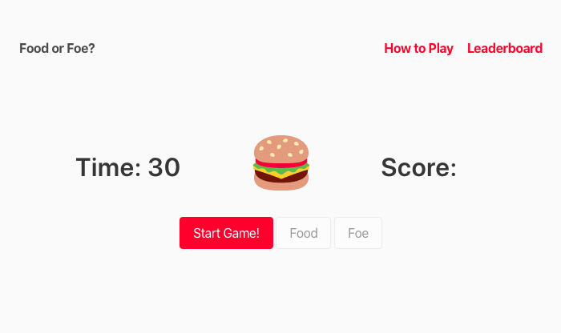

# Food or Foe?

How many food emoji can you correctly identify in 30 seconds?

Each correct answer is worth 1 point. A wrong answer decreases your score by 1 point.

At the end of a round, add your name and score to the leaderboard!

Happy guessing!



## Installation

```
git clone https://github.com/scrabill/food-or-foe.git
cd food-or-foe/backend
rails db:migrate
rails db:seed
rails s
```

To play, open `frontend/index.html` in a browser

## API Endpoints

Food or Foe? has three models, each of which can be accessed at the following endpoints.

- http://localhost:3000/api/v1/users
- http://localhost:3000/api/v1/games
- http://localhost:3000/api/v1/emojis
- http://localhost:3000/api/v1/emojis/food

## Misc

- [Food or Foe? Video Demo](https://youtu.be/I1Ntg06JUaM) - 1:20
- [Creating Associated Objects in Single Page Applications](https://shannoncrabill.com/blog/ruby-on-rails-api-single-page-javascript-application/)
